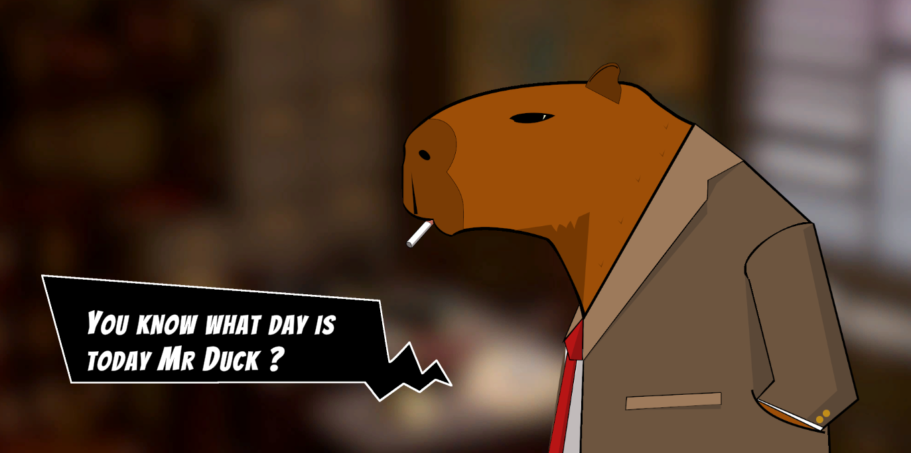

-  THIS PROJECT IS UNACTIVE

# Detective Capybara
<!---Esses são exemplos. Veja https://shields.io para outras pessoas ou para personalizar este conjunto de escudos. Você pode querer incluir dependências, status do projeto e informações de licença aqui--->

> Detective Capybara was a visual novel project that isn't active anymore due to lack of writting ability, all the text is populated with XML and you can write any kind of scene using two existing characters named "Mr Duck" and "Capybara".
> 
### Adjustments and improvementss

I am not developing this game anymore.

- [x] Create character anymation and dialogue box.
- [x] Populate dialogue texts with XML file.
- [x] Create dialogue based in turns and respecting script order.

## 💻 Requirements

Before starting, make sure you've met the following requirements:
* Unity 2020,1,6f1

## 📫 Contributing to Detective Capybara

To contribute to Dectective Capybara, follow these steps:

1. Fork this repository.
2. Create a branch: `git checkout -b <branch_name>`.
3. Make your changes and commit them: `git commit -m '<message_commit>'`
4. Push to the original branch: `git push origin <project_name> / <local>`
5. Create the pull request.

## 😄 Be one of the contributors 

Want to be part of this project? Click [HERE](CONTRIBUTING.md) and read how to contribute.

## 📝 License

This project is under license. See the [LICENSE](CC-BY-4.0.md) file for more details.

[⬆Back to the top](#DetectiveCapybara) 
